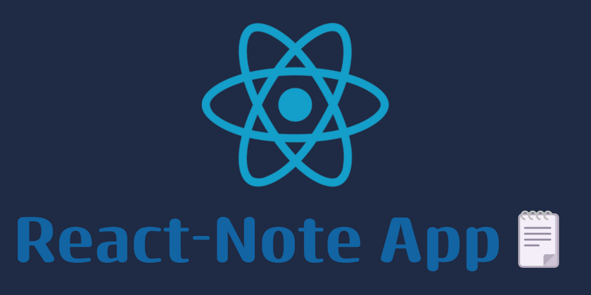
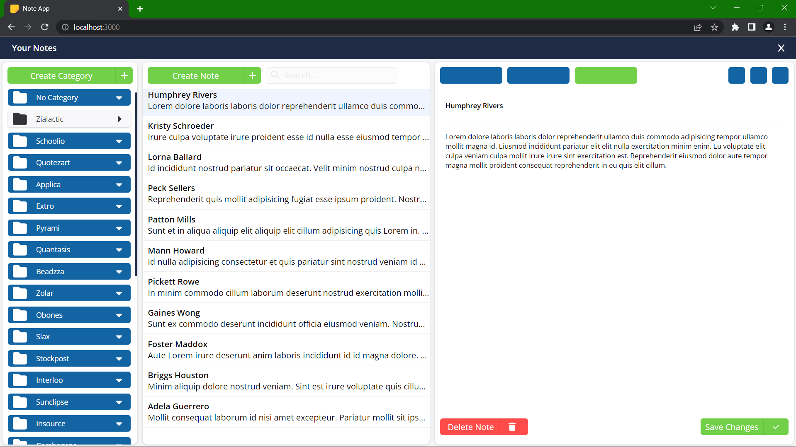
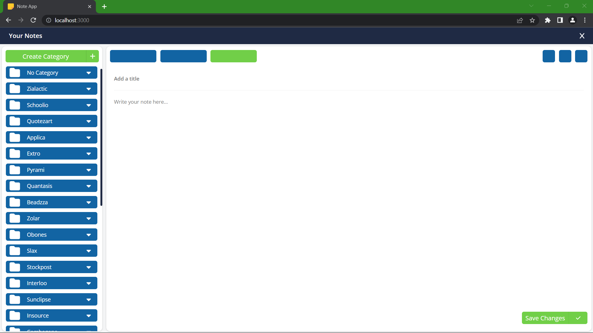
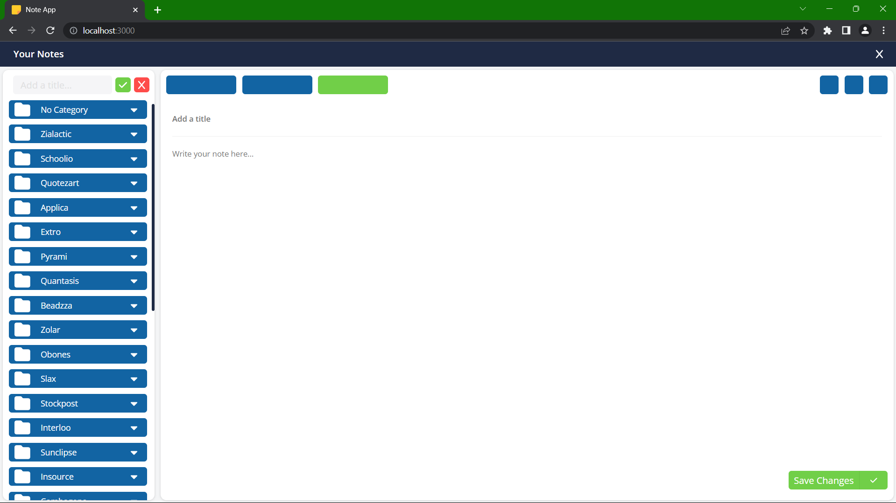
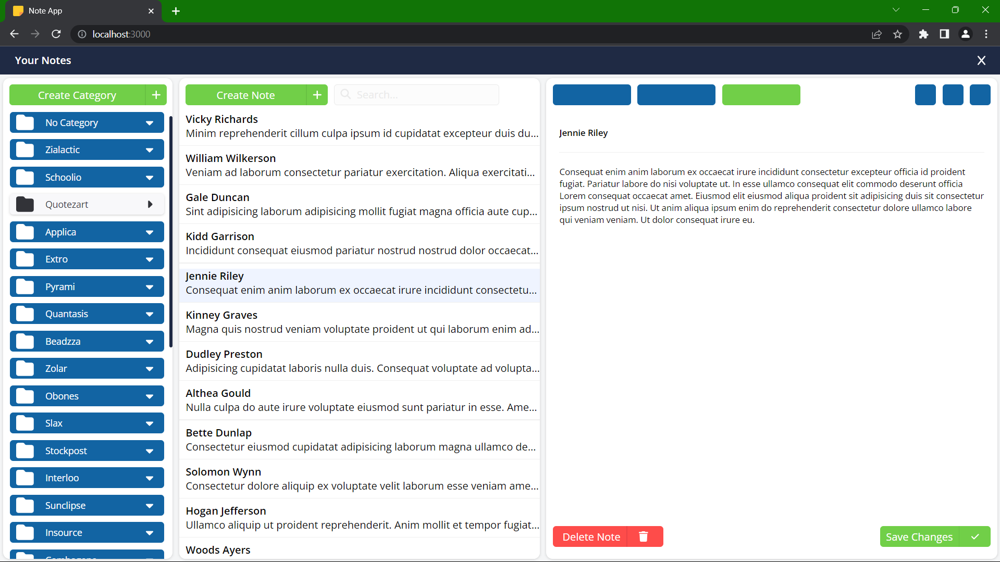
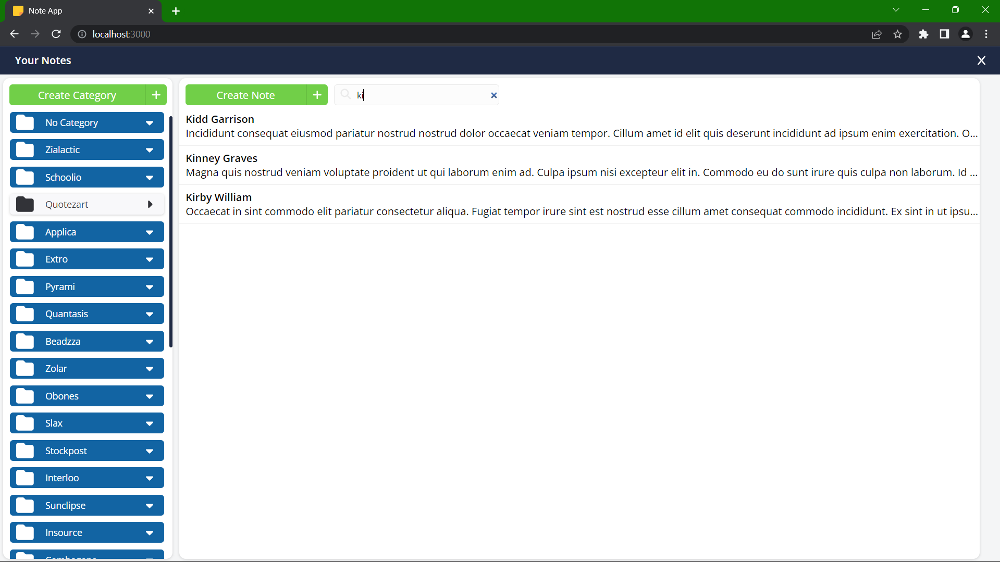

# 

<!-- TABLE OF CONTENTS -->
<details>
  <summary>Table of Contents</summary>
  <ol>
    <li>
      <a href="#about-the-project">About The Project</a>
      <ul>
        <li><a href="#a-screenshot-of-the-app">A screenshot of the app</a></li>
        <li><a href="#features">Features</a></li>
        <li><a href="#technology">Technology<a></li>
      </ul>
    </li>
    <li>
      <a href="#getting-started">Getting Started</a>
      <ul>
        <li><a href="#prerequisites">Prerequisites</a></li>
        <li><a href="#installation">Installation</a></li>
      </ul>
    </li>
    <li><a href="#usage">Usage</a></li>
    <li><a href="#farther-app-development">Farther app development</li>
    <li><a href="#screenshots">Screenshots</a></li>
  </ol>
</details>

## About The Project

This is a small note app that can save or delete notes, save them in different categories and run on a simple server as its database (JSON-Server) to save data.

# 

### Features

- Can a create category with different notes init
- Add notes or delete them
- Modify notes and save them in the server
- Search through notes to find the one you want
- Every data is saved in an file in JSON format

### Technology

- **[React:](https://react.dev/)** React is a popular JavaScript library for building user interfaces. It allows developers to create interactive and dynamic web applications with reusable components.

- **[Node.js:](https://nodejs.org/en)** Node.js is a runtime environment that allows you to run JavaScript on the server-side. It's commonly used for building scalable network applications and server-side scripting.

- **[JSON-Server:](https://www.npmjs.com/package/json-server)** JSON-Server is a simple and convenient tool for quickly creating a RESTful API using JSON data. It's often used for mock APIs and prototyping, making it easy to simulate server behavior with JSON files as data sources.

## Getting Started

### Prerequisites

- You should have installed [Node.js](https://nodejs.org/en)

### Installation

1. Clone the repository

```shell
git clone https://github.com/Elio-Aliaj/reactjs-interview-task.git
```

2. Install NPM packages

```shell
npm install
```

## Usage

1. To run the app, open CMD and locate to the repository:

```shell
cd .\notes_app\
npm start
```

2. Open another CMD to run the server:

```shell
cd .\notes_app\src\Data\
npx json-server --watch db.json --port 8000
```

3. The app can ba access in the browser at http://localhost:3000

## Farther app development

- **To make the app more secure:**
  - Make a register,login and password
  - Encrypt the the database
  - Create end-to-end encryption
  - Keeping the code up to date
  - Input Validation and Sanitization
- **Scale to millions of users**
  - Use a database like Oracle, MySQL, Microsoft SQL Server
  - Three typically common types of database scalability:
    - _Scaling Up_: adding more resources to a single server
    - _Scaling Down_: distributing the database across multiple servers
    - _Read and Write_: scaled separately for read and write operations
  - Backups and Disaster Recovery

## Screenshots






